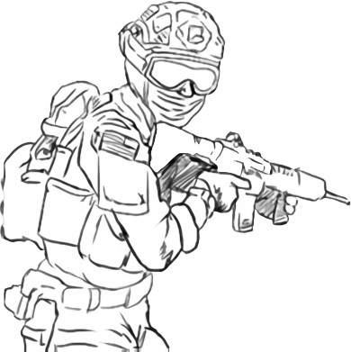
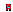
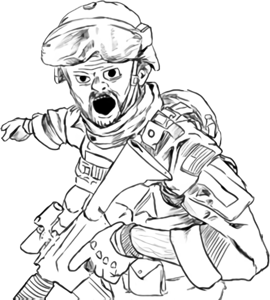

  
  
  

  

  <h1>Hello there!</h1>
  
I'm a junior full-stack developer.

  <ul type="none">
    <li>▶ Currently studying System Analisys and Development.</li>
    <li>▶ Working on some personal projects.</li>
    <li>▶ Accepting freelance jobs.</li>
  </ul>

 

  
  
  
  
  
  

 

   
  

